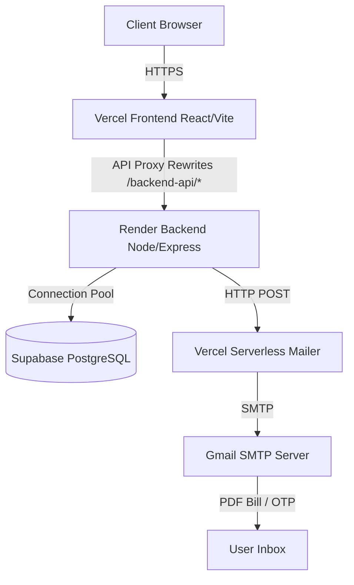

<div align="center">
  
  # 🍛 Khaana – Premium Food Delivery Platform

  <p align="center">
    A full-stack food ordering and restaurant management platform built with modern web technologies. 
    Connecting food enthusiasts with elite restaurants through a seamless, premium interface.
  </p>

  [](https://reactjs.org/)
  [](https://nodejs.org/)
  [](https://expressjs.com/)
  [](https://www.postgresql.org/)
  [](https://tailwindcss.com/)
  [](https://vercel.com/)
  
  <h3>
    <a href="https://khaana-food-delivery.vercel.app">🔴 Live Demo</a>
    <span> | </span>
    <a href="#-architecture">🏗️ Architecture</a>
    <span> | </span>
    <a href="#-features">✨ Features</a>
  </h3>

</div>

<br />

---

## 🚀 Live Demo

The application is deployed and live!

- **Frontend:** [khaana-food-delivery.vercel.app](https://khaana-food-delivery.vercel.app) (Hosted on Vercel)
- **Backend API:** Hosted on Render
- **Database:** Supabase PostgreSQL

---

## ✨ Features

### 👤 For Customers
- **Authentication:** Secure OTP-based registration and password recovery.
- **Restaurant Discovery:** Browse elite restaurants, view ratings, and explore visually rich menus.
- **Real-Time Cart:** Seamless item management with dynamic pricing and delivery fee calculation.
- **Secure Payments:** Integrated Razorpay checkout flow.
- **Order Tracking:** Track order status from preparation to delivery.
- **Automated Invoices:** Instantly receive PDF bills sent directly to your email.

### 🏪 For Restaurant Owners
- **Owner Dashboard:** Dedicated portal to manage restaurants and menus.
- **Order Management:** Accept incoming orders and incrementally update their status (`Preparing` -> `Out for Delivery` -> `Delivered`).
- **Live Notifications:** Automated email notifications sent to customers when their order status changes.

### 🛡️ System Features
- **Role-Based Access Control (RBAC):** Strict JWT middleware protecting routes for Customers, Owners, and Admins.
- **High-Performance DB:** Raw SQL queries leveraging PostgreSQL stored procedures and constraints.
- **AI Order Bot:** Simulated restaurant-side progression for automated testing of order flows.
- **Serverless Email Proxy:** Bypasses hosting SMTP restrictions using a dedicated Vercel Serverless Function to reliably deliver NodeMailer emails.

---

## 🏗️ Architecture



---

## 🛠️ Tech Stack

- **Frontend:** React.js, Vite, Tailwind CSS, React Router DOM, React Hot Toast
- **Backend:** Node.js, Express.js, `pg` (PostgreSQL client)
- **Authentication:** JWT (JSON Web Tokens), bcrypt for password hashing
- **Database:** PostgreSQL (Hosted on Supabase)
- **Third-Party Services:**
  - **Mailing:** Nodemailer with Vercel Serverless Proxy (to bypass Render SMTP blocks)
  - **Payments:** Razorpay
  - **Document Gen:** PDFKit (In-memory buffer generation)

---

## 📂 Project Structure

```text
khaana-food-delivery/
├── frontend/                 # React & Vite application
│   ├── src/
│   │   ├── components/       # Reusable UI elements (Navbar, Cards)
│   │   ├── context/          # Global Auth & Cart state
│   │   ├── pages/            # Application views (Home, Login, Orders)
│   │   └── services/         # Axios API configuration
│   ├── api/                  # Vercel Serverless Functions (Mailer proxy)
│   └── vercel.json           # Frontend routing and proxy configuration
│
├── backend/                  # Express.js REST API
│   ├── db/                   # PostgreSQL pool connection & schema setup
│   ├── middleware/           # JWT & Role validation
│   ├── routes/               # API Endpoints (Auth, Orders, Restaurants)
│   ├── utils/                # Mailer & PDF Generation
│   └── server.js             # Express entry point
│
├── render.yaml               # Render.com deployment blueprint
└── README.md
```

---

## ⚙️ Local Development Setup

To run this project locally, you will need **Node.js** and **PostgreSQL** installed.

### 1. Clone the repository
```bash
git clone https://github.com/shubham-karabantnal/khaana-food-delivery.git
cd khaana-food-delivery
```

### 2. Configure Backend
```bash
cd backend
npm install
```
Create a `.env` file in the `/backend` directory:
```env
PORT=8080
DATABASE_URL=postgresql://<user>:<password>@<host>:5432/<dbname>
JWT_SECRET=your_super_secret_jwt_key
GMAIL_USER=your_email@gmail.com
GMAIL_APP_PASSWORD=your_gmail_app_password
RAZORPAY_KEY_ID=your_razorpay_key
RAZORPAY_KEY_SECRET=your_razorpay_secret
```

Start the backend development server:
```bash
npm run dev
```

### 3. Configure Frontend
Open a new terminal window:
```bash
cd frontend
npm install
```
Start the frontend development server:
```bash
npm run dev
```

The application will be available at `http://localhost:5173`.

---

## 🧑‍💻 Author

Developed by **Shubham Karabantnal**.
